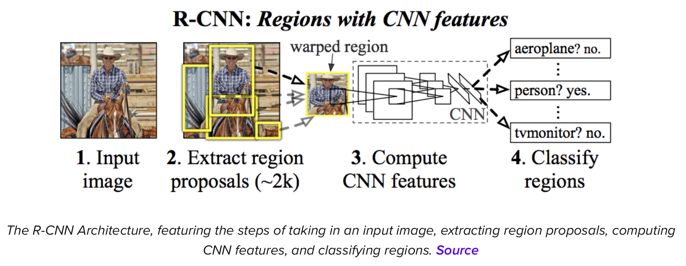

# Object detection 
OD is on one of the top-most ML features being used now.
There are many OD algorithms:
* R-CNN
* YOLO
* Fast R-CNN
* Fasetr R-CNN

and definitely even more.

## R-CNN (Region-based Convolutional Neural Network)

    

### References
* [What is R-CNN?](https://blog.roboflow.com/what-is-r-cnn/)

### Files
* [files/What_is_R-CNN.pdf](files/What_is_R-CNN.pdf)

## YOLO (You only look once)

### References
* [OBJECT DETECTION: YOLO VS FASTER R-CNN](https://www.irjmets.com/uploadedfiles/paper//issue_9_september_2022/30226/final/fin_irjmets1664212182.pdf)

### Files
* [files/OBJECT_DETECTION_YOLO_VS_FASTER_R-CNN.pdf](files/OBJECT_DETECTION_YOLO_VS_FASTER_R-CNN.pdf)

